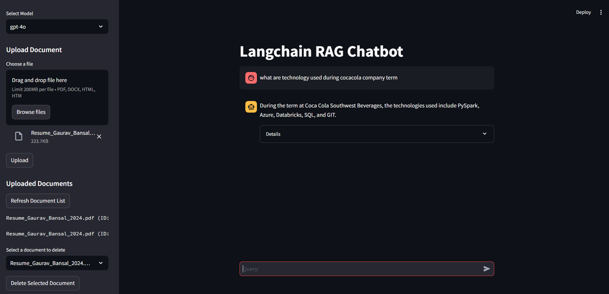

# conversation-rag
* Step 1:- Get an Open API Key and include in .env file and Run Stream lit app using "streamlit run streamlit_app.py"
* Step 2:- Turn on Fast API server using "uvicorn main:app --reload"
* Step 3:- Open "http://127.0.0.1:8000/docs" you can see created endpoints
* Step 4: Interact as many times as you want 
 
